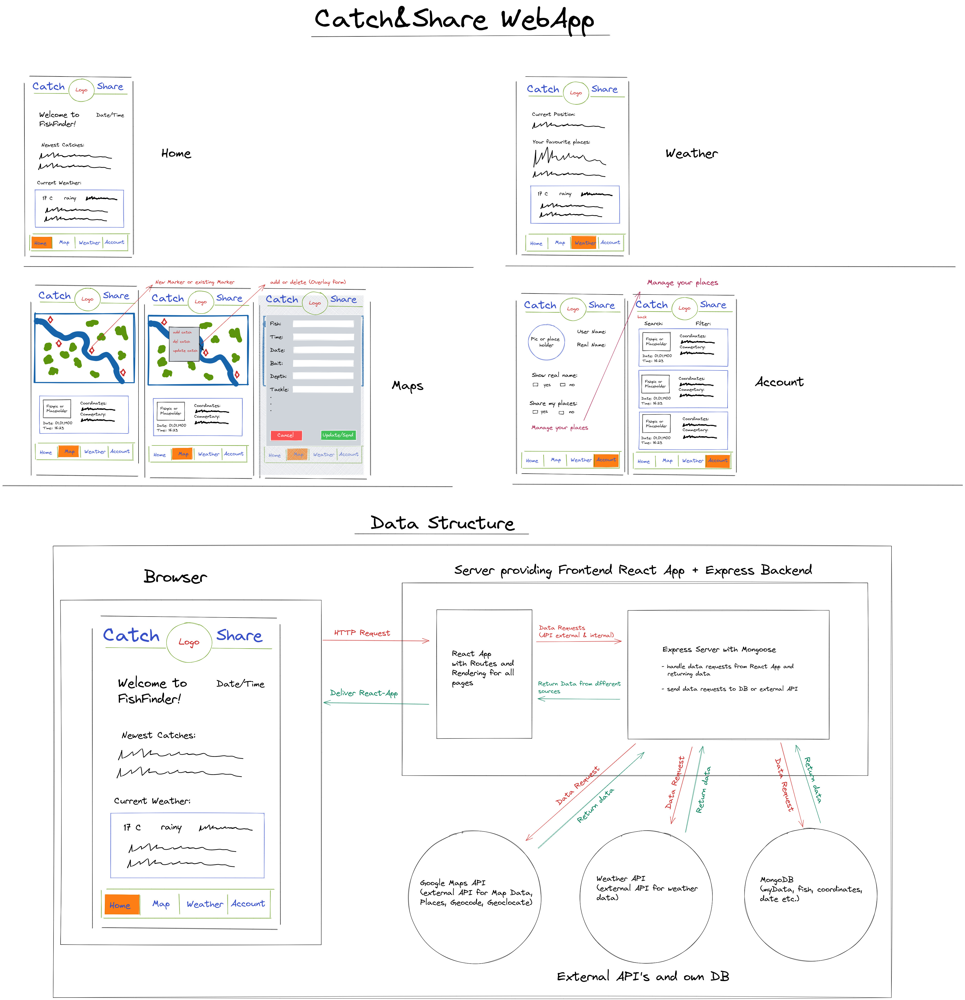

# Catch & Share - Capstone-Project
Capstone Project of neuefische GmbH WebDev Bootcamp

## UPDATE! This App was my capstone project at the end of my web-development bootcamp course. It's finished so to say, but not in a state that I will describe ready for production. Maybe I will continue working on this, maybe not, depends on available time with my new job as a dev. 
 

### About
> The WebApp is called Catch & Share and will be an App for anglers/fisherman to share their catches on a map by just clicking on the current location of the catch.  
They can share/manage/update/delete all informations around the catch that can be interesting for other anglers/fisherman like daytime, fish, length, weight, bait, depth, tackle etc.  
Further, if enough people share their catches the whole data could be interesting for research programms about fish, for instance if a new hydropower plant prevent fish from migrating. 

 

### Used Technologies
> - React with Vite.js for the frontend 
> - Express.js for the backend, further mongoose to handle the db
> - MongoDB as db
> - Google API for map, places, geocode, geolocate
> - tomorrow.io Weather API

 

### Info about the bootcamp neuefische GmbH and this project
> - 12 week WebDev bootcamp seperated in 8 weeks learning + 4 weeks capstone project.
> - this capstone project is planned to be in a ready for production state in 4 weeks.  
> - start: Monday, 10. January 2022
> - end: Friday, 04. February 2022

 

### Draft
> 

 

### About me
> - Manuel Verweyen, 38 years, worked in forwarding/shipping agencies and port logistics for the last 20 years.
> - Motivation for the bootcamp: I want to fullfill my old dream to be an developer. I was always interested in programming since I wrote my first programms with basic on my C64 back in the days.
> - Please feel free to get in contact if you want to know more. 

 

### Info for Devs
- there are two env files, one on the main folder and one in the client folder. Please see both env.EXAMPLE for info how to fill
- "npm run dev" will start client on localhost:3000(default) and server on localhost:4000(default) 
- "npm run server" will start backend server only (default port 4000)
- "npm run client" will start frontend only (default port 3000)
- "npm run build" will build Frontend Client with Vite.js
- if build was done "npm server" will start server on localhost:4000(default) and will deliver client as static asset. Please note if you're not using port 4000 change proxy in vite.config.js (client folder)
